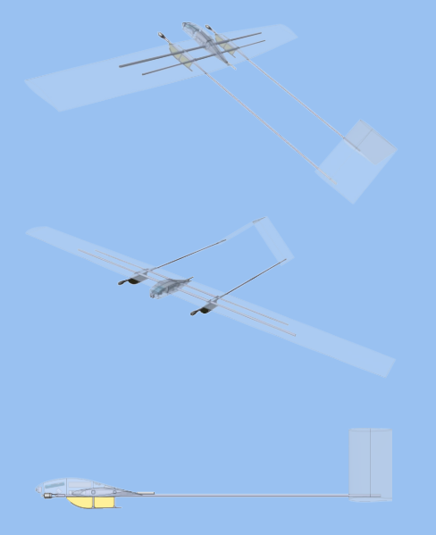
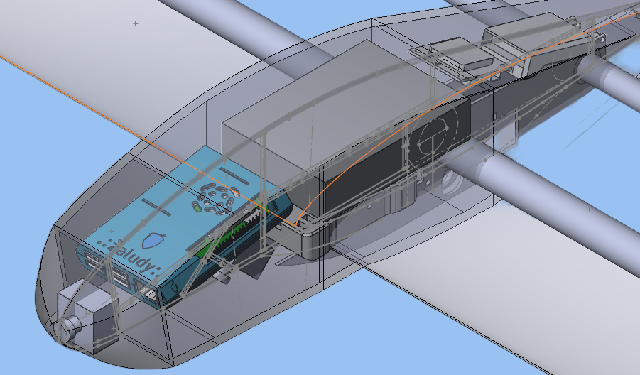

## Содержание проекта

* [Основная информация](#основная-информация)
* [Технологии](#технологии)
* [БРЭО](#брэо)
* [Машинное обучение](#машинное-обучение)

## Основная информация
Здесь содержится основная информация по программному обеспечению беспилотника, собранного командой ВУНДЕРБАУ.

Наша идеология: _БПЛА должен сочетать в себе многофункциональность, автономность, простоту в производстве и обслуживании и дешевизну._

Мы собрали беспилотник с самолетным типом фюзеляжа.

В качестве управляющего элемента используем raspberry pi.

## Технологии
Для реализации проекта мы использовали следующие технологии:
* opencv
* ultralytics
* pygpio
	
## БРЭО
#### Директория _БРЭО_
Пока в процессе разработки

## Машинное обучение
#### Директория _Machine_Learning_
Мы выбрали для проекта архитектуру YOLO (You Only Look Once). Это передовая архитектура нейронной сети, которую можно использовать для обработки в режиме реального времени. Используем реализацию из библиотеки ultralytics.

Также нам необходимо набрать выборку для обучение, для этого используем opencv. Совмещаем картинки с буквами с изображениями из интернета. Это простой способ создать выборку до полетов.
