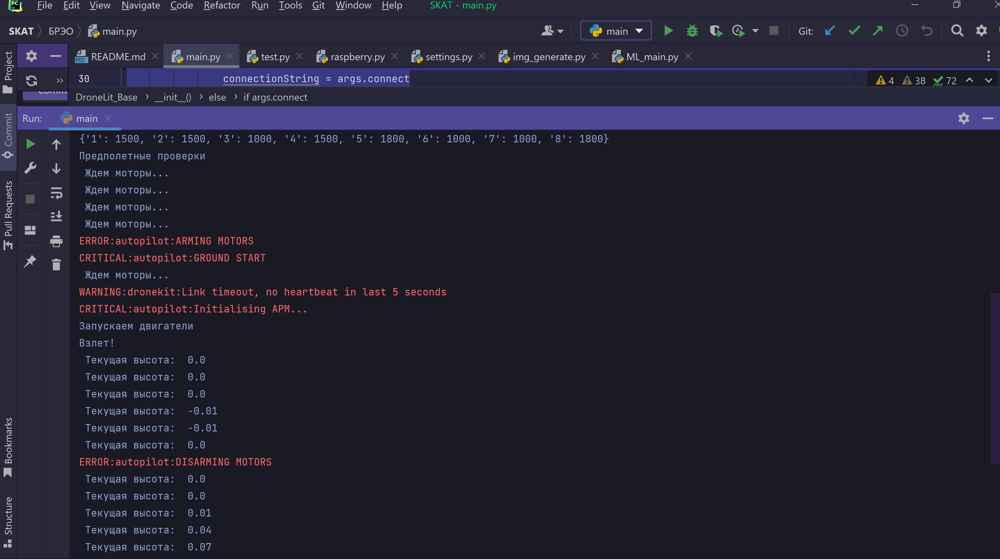

## Содержание проекта

* [Основная информация](#основная-информация)
* [Технологии](#технологии)
* [БРЭО](#брэо)
* [Машинное обучение](#машинное-обучение)

## Основная информация
Здесь содержится основная информация по программному обеспечению беспилотника, собранного командой ВУНДЕРБАУ.

Наша идеология: _БПЛА должен сочетать в себе многофункциональность, автономность, простоту в производстве и обслуживании и дешевизну._

Мы собрали беспилотник с самолетным типом фюзеляжа.

## Технологии
Для реализации проекта мы использовали следующие технологии:
* opencv
* ultralytics
* pygpio
* dronekit
* dronekit-sitl
* Mission Planner
	
## БРЭО
#### Директория _БРЭО_

В качестве управляющего элемента используем связку Raspberry Pi и Pixhawk. Выбор именно такого сочетания обсуловлен удобством разработки и управления. Pixhawk - хорошо документированные надежные полетные контроллеры, включающие в себя микроконтроллер на базе ядра ARM Cortex M4, дополнительный микроконтроллер, гироскоп, акселерометр, магнитометр, барометр, помимо этого можно подключать к ним дополнительные интерфейсы по UART, что и используется нами. Само управление и обработка изображений осуществляется через Raspbery Pi. Микрокопьютер по сути proxy-сервер.

При работе с Pixhawk был выбран стек разработки Ardupilot, так как он дружелюбнее и содержит большее количетво материалов для изучения. Управление будет осуществляться с помощью библиотеки dornekit, так как она уже содержит функции для выполнения базовых операций, таких как запуск и выключение моторов, считывание параметров с датчиков, перелёт по заданным координатам, а также функционал по формированию миссий. На данный момент были запущены тестовые симуляции полётов (БРЭО/test.py), ведётся разработка класса для пилотирования (БРЭО/main.py) и модуля для реализации их связи (БРЭО/raspberry.py). По техническим причинам (бракованный pixhawk) тестовые полеты пока только в качестве симуляций.

## Машинное обучение
#### Директория _Machine_Learning_
Мы выбрали для проекта архитектуру YOLO (You Only Look Once). Это передовая архитектура нейронной сети, которую можно использовать для обработки в режиме реального времени. Используем реализацию из библиотеки ultralytics.

Также нам необходимо набрать выборку для обучение, для этого используем opencv. Совмещаем картинки с буквами с изображениями из интернета. Это простой способ создать выборку до полетов.
На данный момент разрабатывается алгоритм увеличения читаемости текста. Ниже приведен пример нашей работы.

